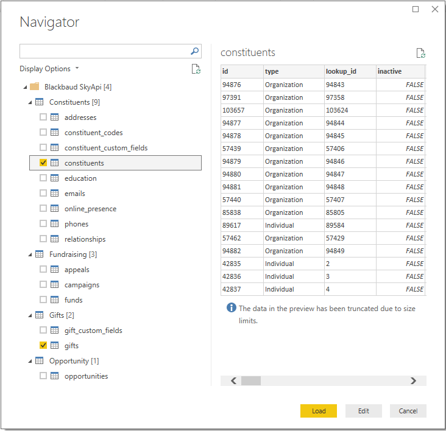

## BlackbaudSkyApi
A Power BI custom data connector for the Blackbaud SKY API. Currently supports Raiser's Edge. Financial Edge support may be added in the future. The connector is not owned, developed or supported by Blackbaud, and as such is defined by Power BI as an [uncertified connector](https://docs.microsoft.com/en-us/connectors/custom-connectors/submit-certification#certification-criteria). See CHANGELOG.md for recent changes.
.

## Getting Started
These instructions will describe how to configure the SKY API connector in order to connect to your organisation's data. See Microsoft's guide to installing and using custom data connectors in Power BI [here](https://github.com/Microsoft/DataConnectors).

You will need to create and register an application with SKY API for the purpose of generating the requisite IDs used when making a connection to your data. A Blackbaud developer account is required in order to create an application. Once an application has been created, you will need the **client_id** of the application, the **client_secret** of your application, and your developer account's **api_subscription_key**.

### Setting up a Blackbaud developer account
Follow the instructions at https://developer.blackbaud.com/skyapi/docs/getting-started to create a developer account and acquire your **api_subscription key**.

### Creating an app
Follow the instructions at https://developer.blackbaud.com/skyapi/docs/createapp to register and activate your app. Registering your app will generate a **client_id** and **client_secret** for the app. Ensure that at least one of the Redirect URLs for the app you create is set to https://oauth.powerbi.com/views/oauthredirect.html

### Installing the connector
1. If one does not already exist, create a `[My Documents]\Microsoft Power BI Desktop\Custom Connectors` directory
2. Download the SkyApi.mez file from this repo, or grab the latest release from the [Releases](https://github.com/GrantQuick/BlackbaudSkyApi/releases) area and extract the contents. Place the SkyApi.mez file in the `[My Documents]\Microsoft Power BI Desktop\Custom Connectors` directory.
3. Rename the SkyApi.mez file to SkyApi.zip
4. Open up SkyApi.zip. Edit the client_id, client_secret and api_subscription_key files. In each file, copy and paste the character strings for the appropriate entity (the client_id, client_secret and api_subscription_key generated when creating a Blackbaud developer account and app) into the correct file. Save the changes to each of the three files.
5. Rename SkyApi.zip back to SkyApi.mez.
6. Enable the **Custom data connectors** preview feature in Power BI Desktop (under *File | Options and settings | Custom data connectors*).
7. As of the July 2018 release, Power BI will additionally alert users to change their security settings in order to enable uncertified custom data connectors to be used. To do this, go to *File | Options and settings | Security*, and under **Data Extensions**, enable **(Not Recommended) Allow any extension to load without validation or warning**.
7. Restart Power BI Desktop
8. In Power BI Desktop, click **Get Data > Other > Blackbaud SkyAPi (Beta)**
9. The first time you use the connector you will need to log in using your Blackbaud account and authorise the app to work with your data.

## Supported Endpoints
Additional endpoints will be added in time. Currently the connector supports:
* Constituent list
* Phone list
* Email Address list
* Address list
* Education list
* Constituent Code list
* Online Presence list
* Relationship list
* Constituent Custom Field list
* Gift list
* Gift Custom Field list
* Appeal list
* Campaign list
* Fund list
* Opportunity list
* Notes list
* Action list
* Memberships list

## Additional Information
The connector generates a basic data model. Selected list or record type data fields have been expanded where they would not affect row counts. List and record type fields will still have to be expanded on the Gift and Opportunity tables when designing your own data model. For example, when connecting to the Gifts endpoint, in Power BI you will need to click **Edit Queries** in order to expand and view the gift splits.

When using the connector, it is recommended to **only select the endpoints that are necessary for any given reporting purpose**. Endpoints that are not required as part of a specific Power BI dashboard/report should be omitted from your connection as they will introduce superfluous calls to the SKY API, and could cause throttling/quota issues. The Actions endpoint, for example, may be unnecessary for most reporting purposes and may include large a large number of records. If this is the case in your organisation, including the Actions endpoint will result in a significant increase in the time it takes to refresh your data as well as cause a substantial increase in consumed bandwidth.

## Scheduled Refresh - Power BI Service
The connector supports scheduled refresh through the Power BI service via a Power BI On-Premises Data Gateway (Personal mode). In order to take advantage of this, the following steps need to be performed:

1. Install the Power BI On-Premises Data Gateway in Personal mode
2. Enable Custom Connector support in the Gateway - see guide [here](https://github.com/Microsoft/DataConnectors/tree/master/samples/TripPin/9-TestConnection#enabling-custom-connectors-in-the-personal-gateway)
3. Publish a workbook that uses your connector to PowerBI.com
4. Configure scheduled refresh - see guide [here](https://github.com/Microsoft/DataConnectors/tree/master/samples/TripPin/9-TestConnection#testing-scheduled-refresh) and follow the instructions from *After publishing, go to PowerBI.com and find the dataset...*

## Known Issues
Blackbaud have recently added a list endpoint for an optional module, the Membership list. Support for this endpoint has been added to the connector, but limited testing has been performed as this is not a module which is available in my organisation. Issues/feedback on this particular endpoint are welcome. For all organisations that have not opted to purchase this additional module from Blackbaud, if the Memberships endpoint is selected by the user during the Get Data process, Power BI will produce an error stating that *Access to the resource is forbidden* as the connector attempts to preview data. This means that your Blackbaud account does not have access to that specific module. Other endpoints will be unaffected, and can be selected as usual. This will be the case for all optional modules for which Blackbaud subsequently add SKY API support, where that module is not available in your organisation.

Depending on dataset size, data load time can be long, although Blackbaud have worked to improve the speed of call processing. As a maximum of 500 (or 5000, depending on the endpoint) records can be returned by any single call to an endpoint, datasets of several hundred thousand records will require many hundred calls to the API. The API also employs rate limiting to prevent overload of Blackbaud servers. This can mean that data loads of all endpoints will take several minutes. Connecting to only the required endpoints will reduce data load time.

## Authors
* **Grant Quick** - *Initial work* - [GrantQuick](https://github.com/GrantQuick)

## Acknowledgments
* This connector is based on the [custom data connector samples](https://github.com/Microsoft/DataConnectors) provided by [Microsoft](https://github.com/Microsoft)
* Thanks to Microsoft’s [CurtHagenlocher](https://gist.github.com/CurtHagenlocher) for the [Web.ContentsCustomRetry](https://gist.github.com/CurtHagenlocher/68ac18caa0a17667c805) function.
